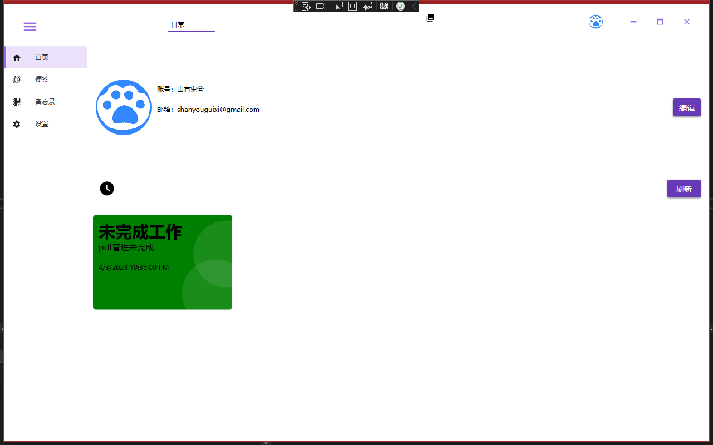
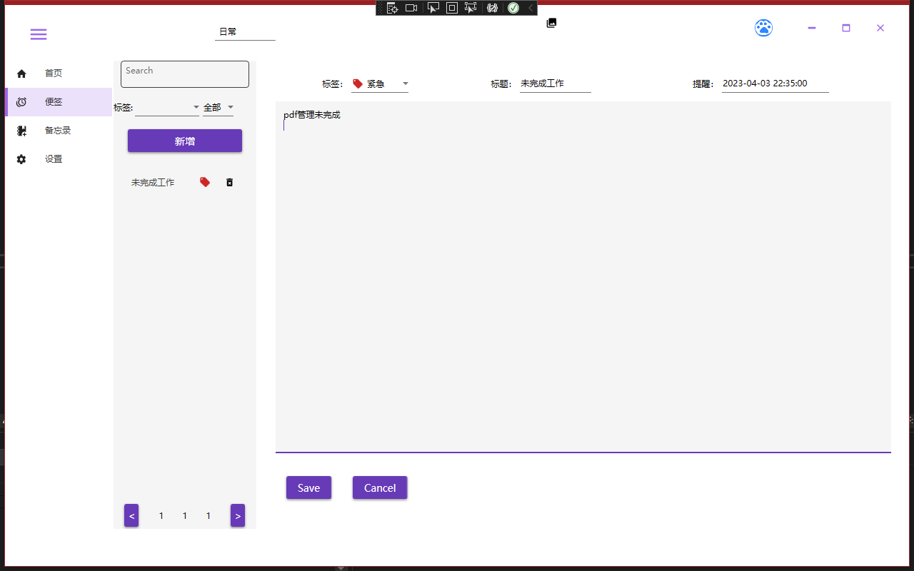
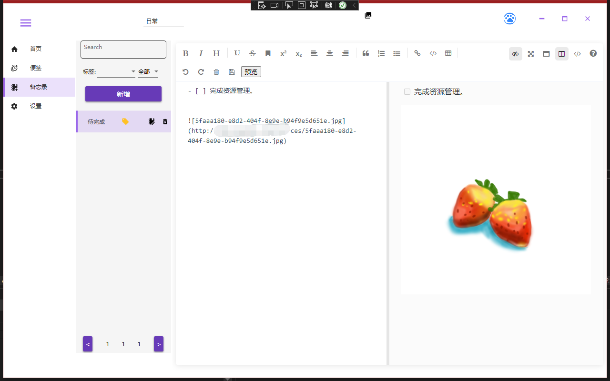
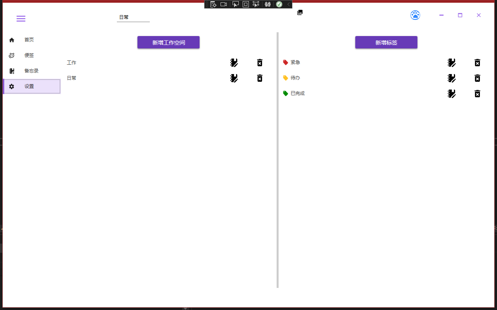
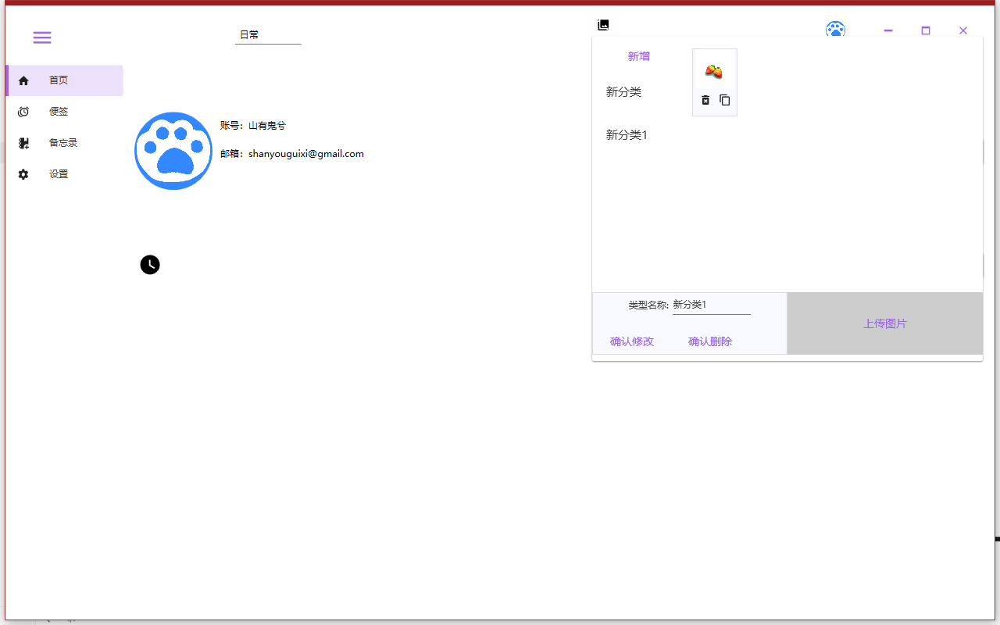

# 项目说明

本项目是作为初学者学习wpf得第一个项目。

参考学习 [痕迹大佬](https://github.com/HenJigg/my-todoapp) 的项目。

- 首页
  - 右上角头像退出、注销
  - 个人信息编辑
  - 便签

- 便签
  - 通过工作空间、便签、时间筛选
  - 设置提醒时间会在首页出现

- 备忘录
  - 使用webview，Markdown编辑器使用[mavonEditor](https://github.com/hinesboy/mavonEditor)
  - 工作空间、标签、时间搜索

- 设置
  - 工作空间设置
  - 标签设置

- 资源管理
  - 资源分类
  - 上传资源
  - 复制Markdown语法图片链接

